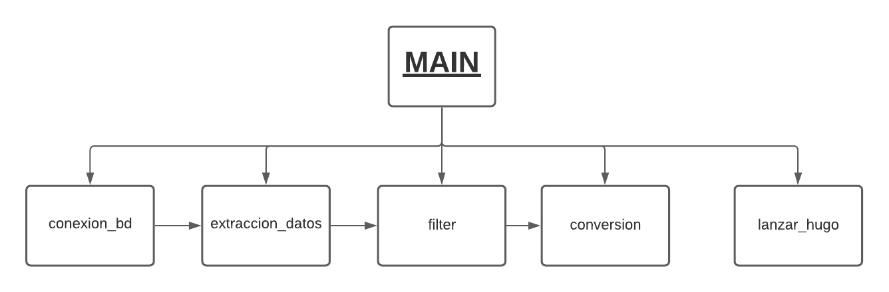

# Proyecto_pydepvops
This is a project developed by Isaac Palou and Joan Llompart.

----
=======
## **Introducción:**

-----------

## **Metodología:**
En nuesto caso hemos usado la metodología Scrum ya que nos ha permitido obtener pequeños resultados a corto plazo.

### EXPLICACIÓN
La metodología Scrum es un proceso para llevar a cabo un conjunto de tareas de forma regular con el objetivo principal de trabajar de manera colaborativa, es decir, para fomentar el trabajo en equipo.

Con este método de trabajo lo que se pretende es alcanzar el mejor resultado de un proyecto determinado. Las prácticas que se aplican con la metodología Scrum se retroalimentan unas con otras y la integración de las mismas tiene su origen en un estudio de cómo hay que coordinar a los equipos para ser potencialmente competitivos.
### FASES
- 1. Planificación: Product Backlog

>El Product Backlog es la fase en la que se establecen las tareas prioritarias y donde se obtiene información breve y detallada sobre el proyecto que se va a desarrollar.

- 2. Ejecución: Sprint

>Dentro del método Scrum, el Sprint es el corazón, un intervalo de tiempo que como máximo tiene una duración de un mes y en donde se produce el desarrollo de un producto que es entregable potencialmente.

>Para entenderlo mejor, si el Product Owner solicita el producto se requiere un mínimo esfuerzo para su entrega al cliente.

>También se puede definir el Sprint como un mini proyecto en donde el equipo de trabajo se focaliza en el desarrollo de tareas para alcanzar el objetivo que se ha definido previamente en el Sprint planning.

- 3. Revisión del sprint

>Es la fase en la que se mide el progreso de un determinado proyecto Scrum. En ella, el Scrum Master será el encargado de actualizar los gráficos cuando se finalice cada uno de los Sprint.

## **Análisis:**

Las tecnologias que hemos estado utilizando para el proyecto PyDevops son:

- Base de datos *MongoDB*  es una base de datos orientada a documentos. Esto quiere decir que en lugar de guardar los datos en registros, guarda los datos en documentos.Es de código abierto y utiliza un sistema de base de datos NoSQL.

- Hugo: Hugo es un generador de sitios web estáticos escrito en Go, y es software libre.

-------------
DIAGRAMA COMPONENTES

## **Diseño:**

-----------

## **Implementación:**

-----------

## **Pruebas:**

-----------

## **Comparación Temporal:**

-----------

## **Dificultades:**

-----------

- Problema con la conexión a la base de datos MongoDB que se solucionó instalando un certificado en la maquina y importando *certifi* en el modulo de conexion_bd.py

- Problemas para averiguar como darle un nombre diferente a cada archivo MD para que no se escribieran todos en el mismo.
