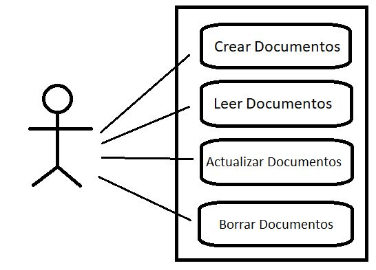
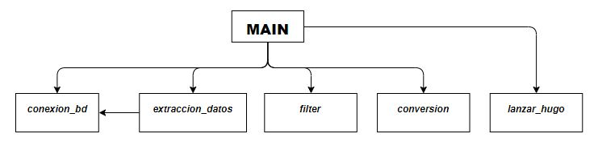
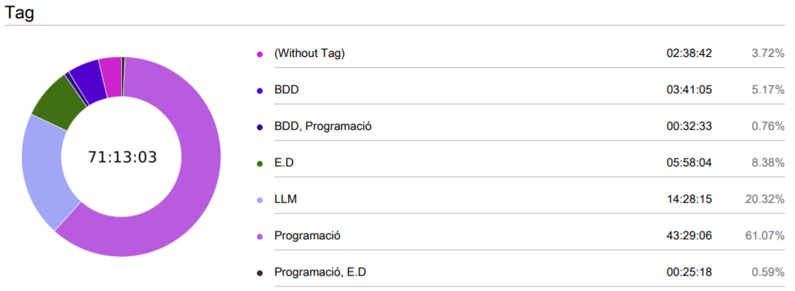

# Proyecto_pydepvops
This is a project developed by Isaac Palou and Joan Llompart.

----
=======
## **1. Introducción:**
En este proyecto el objectivo que el Product Owner nos exigia era un programa que recogiera los items de la base de datos MongoDB convertir los JSON a diccionarios Python, luego el programa con logica Python tiene que cojer los items de esa base de datos y convertir-los ha Markdown para que luego con el generador de sitios staticos Hugo coja los fitxeros Markdown y los convierta a html directamente para poder ser visualizados en la web que genera hugo, finalmente desde la pagina de hugo tienen que poder crear,actualizar y borrar los items, en la base de datos de Mongo Atlas.

-----------

## **2. Metodología:**
En nuesto caso hemos usado el marco de trabajo Scrum ya que nos ha permitido obtener pequeños resultados a corto plazo, por otro lado era el que mas experiencia teniamos usandolo.
### EXPLICACIÓN
La metodología Scrum es un proceso para llevar a cabo un conjunto de tareas de forma regular con el objetivo principal de trabajar de manera colaborativa, es decir, para fomentar el trabajo en equipo.

Con este método de trabajo lo que se pretende es alcanzar el mejor resultado de un proyecto determinado. Las prácticas que se aplican con la metodología Scrum se retroalimentan unas con otras y la integración de las mismas tiene su origen en un estudio de cómo hay que coordinar a los equipos para ser potencialmente competitivos.
### FASES
1.Planificación: Product Backlog

>El Product Backlog es la fase en la que se establecen las tareas prioritarias y donde se obtiene información breve y detallada sobre el proyecto que se va a desarrollar.

2.Ejecución: Sprint

>Dentro del método Scrum, el Sprint es el corazón, un intervalo de tiempo que como máximo tiene una duración de un mes y en donde se produce el desarrollo de un producto que es entregable potencialmente.

>Para entenderlo mejor, si el Product Owner solicita el producto se requiere un mínimo esfuerzo para su entrega al cliente.

>También se puede definir el Sprint como un mini proyecto en donde el equipo de trabajo se focaliza en el desarrollo de tareas para alcanzar el objetivo que se ha definido previamente en el Sprint planning.

3.Revisión del sprint

>Es la fase en la que se mide el progreso de un determinado proyecto Scrum. En ella, el Scrum Master será el encargado de actualizar los gráficos cuando se finalice cada uno de los Sprint.

---

## **3. Análisis:**

### **Partes Interesadas y Requisitos Funcionales/No Funcionales**

En nuestro caso solo tenemos como parte interesada el cliente ya que es el que podra gestionar los documentos.

**NOMENCLATURA**

RF_Cliente_XX

**REQUISITOS FUNCIONALES**

- RF_Cliente_01: Crear Dpcumentos(C)
- RF_Cliente_02: Leer Documentos(R)
- RF_Cliente_03: Actualizar Documentos(U)
- RF_Cliente_04: Borrar Documentos(D)

**REQUISITOS NO FUNCIONALES**

- RnF_01: Extraccion datos.
    - Se extraeran los datos de la base de datos automáticamente . 
- Rnf_02: Filtración datos.
    - Los datos se filtrarán por valoración automáticamente.
- RnF_03: Conversión datos.
    - Se convierten los datos filtrados en MD.
- RnF_04: Generación página
    - Se genera la página automáticamente con esos datos.

### **Diagrama de Casos de Uso**

### **Tecnologías usadas**

-------
## **4. Diseño:**

### **SCHEMA**

~~~
{
  $jsonSchema: {
    bsonType: 'object',
    required: [
      'name',
      'plates',
      'drink',
      'stock',
      'price',
      'discount',
      'valoration'
    ],
    properties: {
      name: {
        bsonType: 'string',
        description: 'must be a string with name of menu'
      },
      plates: {
        bsonType: 'array',
        description: 'must be an array with plates of the menu',
        items: {
          bsonType: 'string',
          description: 'mustb be a string with plate of the menu'
        }
      },
      drink: {
        bsonType: 'string',
        description: 'must be a string with drinks of the menu'
      },
      stock: {
        bsonType: 'int',
        description: 'must be an int of the stock'
      },
      price: {
        bsonType: 'double',
        description: ' must be a double with the price of menu'
      },
      discount: {
        bsonType: 'int',
        description: 'must be an int of the discount'
      },
      valoration: {
        bsonType: 'double',
        description: 'must be a double with the valoration of the menu'
      }
    }
  }
}
~~~

## **5. Implementación:**

Las tecnologias que hemos estado utilizando para el proyecto PyDevops son:

- Base de datos *MongoDB*  es una base de datos orientada a documentos. Esto quiere decir que en lugar de guardar los datos en registros, guarda los datos en documentos.Es de código abierto y utiliza un sistema de base de datos NoSQL.

- Hugo: Hugo es un generador de sitios web estáticos escrito en Go, y es software libre.

-----------

## **6. Pruebas:**

-----------

## **7. Comparación Temporal:**

## **8. Dificultades:**

-----------

- Problema con la conexión a la base de datos MongoDB que se solucionó instalando un certificado en la maquina y importando *certifi* en el modulo de conexion_bd.py

- Problemas para averiguar como darle un nombre diferente a cada archivo MD para que no se escribieran todos en el mismo.

 - Una Dificultat ha sido enternder como funciona exactamente Hugo.

- Dificultades a la hora de organizar el proyecto.

----
## **-Futuras Mejoras:**

- Refactorizar codigo python.
- Automatizar CRUD.(Con formularios de google)
- Implementar mejor TDD.
- Implementar Black, Bandit, Coverage
- Implementar Tox
- Imolementar Typer

